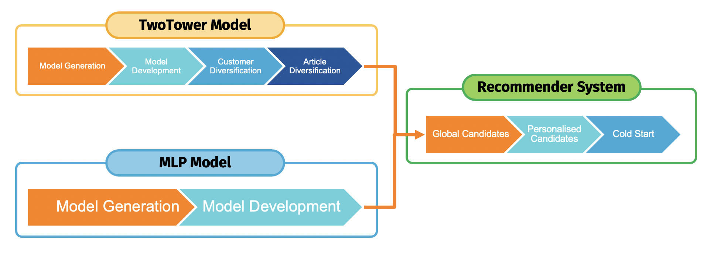

# About the project
In this research report, the efficacy of Deep Neural Networks (DNNs) for retail store recommender systems is explored. The study investigates the comparative performance of DNN-based Matrix Factorisation against MultiLayer Perceptron (MLP) models. Additionally, it evaluates the impact of feature engineering on the TwoTower model and examines the potential of personalized models in enhancing recommender system performance. Findings reveal insights into model performance, the importance of feature augmentation, and the potential for personalized models in retail recommender systems.

# Project Outline
The project process was divided into three parts. The first one involved general data analysis. The second one conisted of the research of the feature engineering. The last one,the most elaborted was strictly focused on the research. 
## Exploratory Data Analysis
The whole analysis could be found at the **eda.py**
## Feature Engineering
The analysis that consist the feature engineering is presented in the **feature_engineering** folder. It contains the **feature_engineering.ipynb** file which consists of the whole analysis. The other file was used to generate submission files which allowed to compare the performance.
## Research Analysis
The whole research analysis can be found in the **src** folder. It contains two types of files, the python scripts and Jupyter Notebooks. The python scripts are used to store all functions which were used during the analysis:
- data_reader.py - stores all functions which are related to the data preprocessing and reading,
- helper.py - contains all training functions,
- model.py - stores the model architectures,
- recommenders.py - contains recommender systems which are based on the trained models,
- candidates_helper.py - stores functions that generate customer groups which are used by personalised models.
The other files were Jupyter Notebooks. All of them contained the analysis with respect to the following research plan: 
The order of the files below follows the research plan:
- models_development.ipynb - contains initial data preprocessing, training base model and their development,
- customer_diversification.ipynb - analysis and creation new features for customer dataset,
- article_diversification.ipynb - analysis and creation new features for article dataset,
- candidates_generation.ipynb - analysis and creation of the customer groups that are used for training personalised models,
- candidates_summary.ipynb - generates all recommendations for all personlised models and compares their performance,
- pipeline.ipynb - gathers all personalised models and global model as one recommender system,
- evaluation.ipynb - gathers all recommendations across different steps of the research and presents evaluations and comparisons.